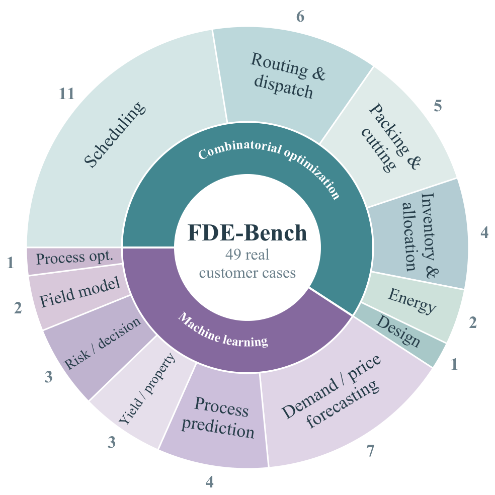
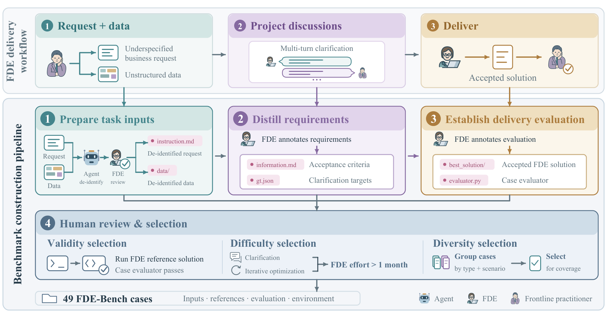

# FDE-Bench

**Evaluating End-to-End Delivery from Underspecified Real-World Business Requests**

[Project page](https://sponyo531.github.io/fde-bench/) · [Paper](https://sponyo531.github.io/fde-bench/assets/FDE-Bench.pdf) · [Case inventory](case/) · [Data download](https://github.com/sponyo531/fde-bench/releases/tag/v0.1.0) · [Quick start](#quick-start) · [Contributing](CONTRIBUTING.md) · [中文说明](README.zh-CN.md)

FDE-Bench evaluates whether an agent can turn an incomplete business request into a deliverable that meets the customer's requirements. It separates asking the right clarification questions from producing a valid, useful solution.

The benchmark contains **49 cases: 29 combinatorial-optimization tasks and 20 machine-learning tasks**, with **266 annotated clarification targets**. Cases cover manufacturing, logistics, energy, retail, finance, and engineering. Each includes an initial request, business data, complete requirements, a deterministic delivery evaluator, and a customer-accepted FDE reference deliverable.

## Why clarification matters

A warehouse customer asks for each stack to contain “one product type,” with as few stock moves as possible. The missing rule: **different batches of the same SKU also count as mixed**. Clarifying that rule changes what a valid storage plan must achieve; the agent must then optimize its solution against the clarified requirements.

[](docs/assets/motivation.webp)

*Figure 1(a) from the paper. The warehouse dialogue and customer reactions are illustrative, not measured agent runs. Select any figure to view it at full resolution.*

<details>
<summary><strong>Task coverage: 49 real customer projects</strong></summary>

<p align="center">
  <a href="docs/assets/coverage.webp"></a>
</p>

*Figure 1(b). Case counts reflect primary computational subtypes; business-scenario tags can overlap.*

</details>

## From real projects to benchmark cases

Each case links the initial customer request and data, the customer–FDE discussions, and the accepted deliverable from the same project. FDE review preserves the original request's level of detail, distills missing requirements, and checks the evaluator against the reference solution.

[](docs/assets/construction.webp)

*Figure 2. The construction pipeline produces agent-visible inputs, hidden requirements, a case-specific evaluator, and a customer-accepted FDE reference. Retained projects required more than one month of FDE work before acceptance.*

## How evaluation works

Agents start with the request and business data. In the main **Interact-Req** condition, they clarify requirements with a simulated customer, then build, execute, inspect, and revise their solution within **12 hours** and **up to 30 clarification rounds**. Hidden evaluation runs only after submission.

[](docs/assets/evaluation.webp)

*Figure 3. Delivery scoring checks constraints and quality against the FDE reference (1.0). Clarification scoring measures whether questions could elicit the annotated requirements; it does not establish that the agent used the answers. Agents receive no hidden-evaluator feedback during solving.*

## Information conditions

The model, task, and agent scaffold stay fixed while information access changes.

| Condition | Initial information | Customer interaction |
| --- | --- | --- |
| Hidden | Initial request and business data | No answers |
| Interact | Initial request and business data | The agent decides whether to ask |
| Interact-Req | Initial request and business data | The agent must clarify before solving and decides when it has enough information |
| Full | Initial request, complete requirements, and business data | No answers |

The paper reports `Hidden`, `Interact-Req`, and `Full`, together with an oracle analysis. `Interact`, `Interact-Conf`, `Full-Base`, `Full-Data`, and `Full-Rule` are additional experiments implemented by the harness; do not read them as reported paper results. `oracle_k<N>` progressively exposes annotated requirements. Delivery scoring checks artifact validity, hard constraints, and task-specific quality. Quality is normalized against the accepted FDE deliverable; that reference is not a claim of global optimality. See the paper and each case evaluator for precise definitions.

## What the experiments show

Across **18 configurations**, the highest mean delivery Quality is **0.5510** (Codex + GPT-6-Astra), while the highest delivery success rate is **6.12%** (OpenHands + Qwen3.8-Max). These are different configurations. See the [interactive leaderboard](https://sponyo531.github.io/fde-bench/#results) for all reported results.

In a separate four-case oracle experiment, providing more registered answers improves mean Quality from **0.059** at 0% coverage to **0.352** at 50% and **0.869** at 100%. The gains are nonlinear: a few unresolved requirements can invalidate an otherwise reasonable solution.

[](docs/assets/oracle.webp)

*Figure 5. Codex + GPT-6-Astra receives nested subsets of registered answers without interaction. At 100% coverage, it receives all registered answers, not the complete business-information file used by Full. This four-case analysis is separate from the 49-case main evaluation.*

## What is included

```text
harness/                 Evaluation, clarification, scoring, and agent adapters
agents/                  Condition-specific instruction blocks
case/<case-name>/
  instruction.md         Initial business request
  information.md         Complete business requirements
  gt.json                Annotated clarification targets
  task.toml              Task metadata
  data/                  Agent-visible inputs, restored from release archives
  environment/           Case-specific dependency environment
  tests/                 Evaluator, schema, reference, and scoring-only truth
env-runner/              Unified runner Docker image
experiments.toml         Experiment matrices and case subsets
data-manifest.json       External data paths, sizes, checksums, and availability
scripts/                 Data restoration and environment build utilities
```

`information.md`, `gt.json`, evaluators, references, and scoring-only truth are kept outside the solving workspace. The term `_private` in a case directory means **hidden from the evaluated agent**, not absent from the public evaluation package. Do not expose the repository root to the solving agent.

### Data availability

Large inputs are distributed as two GitHub Release archives rather than stored in Git history. A source checkout alone does not contain the complete input data.

- `fde-bench-data-case001.tar.gz`: aerodynamic-forecasting case 001.
- `fde-bench-data-cases002-049.tar.gz`: external inputs for the other available cases, **excluding case 040**.

Case 040 (`frailty_cohort_analysis`) retains its protocol and evaluator, but its row-level cohort data, held-out outcomes, and per-person reference output are withheld pending confirmation of redistribution rights. The downloadable data therefore cover **48 of the 49 benchmark cases**. Do not interpret a run without those files as a model failure.

The two archives restore paths under `case/`. See [data release details](DATA.md), including checksums and local-archive installation.

## Quick start

Use Python 3.11 or newer. Linux with Docker is recommended for benchmark runs. Listing available adapters and experiments does not call a model API or require downloaded datasets.

```bash
git clone https://github.com/sponyo531/fde-bench.git
cd fde-bench
python3 -m venv .venv
source .venv/bin/activate
python -m pip install -r requirements.txt
python -m harness --list
```

### 1. Restore case data

```bash
python scripts/fetch_data.py
python scripts/fetch_data.py --check
python -m harness -e smoke --dry-run
```

The script verifies archive checksums before extraction and checks restored files against `data-manifest.json`. The smoke dry run requires restored case inputs but does not call a model API. `--check` also reports the deliberately withheld case separately.

### 2. Configure models and credentials

```bash
cp config.toml.example config.toml
```

Set the answerer and clarification-judge model IDs, API endpoints, and token environment variables in `config.toml`. Credentials belong in environment variables, not tracked files. Select an installed agent CLI listed by `python -m harness --list`.

For OpenCode, copy `opencode-routes.example.jsonc` to a private location outside the repository and configure the routes for your provider. Point `FDE_OPENCODE_CONFIG` to that file. `FDE_EXTRACTOR_OPENCODE_CONFIG` can optionally select a separate scoring configuration; otherwise the extractor uses the solver configuration.

```bash
export FDE_OPENCODE_CONFIG=/absolute/path/to/private/opencode.jsonc
export DELIVER_AGENT_BASE_URL=https://your-chat-endpoint/v1
export DELIVER_AGENT_API_KEY=YOUR_KEY
export DELIVER_JUDGE_TOKEN=YOUR_JUDGE_KEY
export DELIVER_ANSWERER_TOKEN=YOUR_ANSWERER_KEY
```

The example routes `chat/`, `responses/`, and `direct/` denote API protocols/routes, not public hosted services. Configure the corresponding `DELIVER_RESPONSES_*` or `DELIVER_DIRECT_*` variables only when using those routes. Freeze the answerer, judge, extractor, and solver versions when comparing results; changing them changes the evaluation setting.

### 3. Build an execution environment

Build the unified runner, which includes agent CLIs and the scientific-computing stack:

```bash
./build_images.sh --runner
```

The image is `fde-bench-runner:v1`. Building it downloads substantial dependencies and requires Docker/network access. Alternatively, build a case-specific scientific environment with `./build_images.sh 002_city_delivery_route_planning`; these environments rely on the selected agent CLI being installed on the host. The script supports `--dry-run` to inspect commands.

### 4. Run one case

```bash
python -m harness \
  -a opencode -m YOUR_PROVIDER/YOUR_MODEL \
  -c Hidden,Interact,Interact-Req,Full \
  -d 002_city_delivery_route_planning -k 1 \
  --container fde-bench-runner:v1
```

Use `-e smoke --container fde-bench-runner:v1` for the predefined eight-condition smoke matrix. `experiments.toml` contains the paper's larger matrices and provider-neutral model identifiers; adapt model routes to your service rather than assuming those endpoints are supplied with the release. The full E1 case list includes withheld case 040, so a complete 49-case reproduction requires its separately authorized data.

Results default to `results/`. Completed compatible runs are skipped when resuming. To summarize a result directory:

```bash
python -m harness.scoring.report results/opencode
```

## Contribute

Pull requests are welcome. You can propose a new de-identified customer case for a future FDE-Bench release, improve a case evaluator, or add an agent adapter. A case must follow the [case format and review checklist](CONTRIBUTING.md), including its request, visible data, complete requirements, clarification targets, environment, schema, deterministic evaluator, and reference solution.

Please document provenance, de-identification, and data-distribution rights, and keep credentials or private customer material out of pull requests. Open a PR from the [GitHub repository](https://github.com/sponyo531/fde-bench/pulls) and describe what a reviewer can run offline.

## Agent adapters

Adapters are discovered from `harness/backends/`. Supported adapters include OpenCode, Codex, Claude Code, Gemini CLI, Kimi CLI, DeepSeek Harness, and OpenHands. Some require separate installations or optional environments; see their adapter modules and the runner Dockerfile. OpenHands uses the legacy API pinned in the supplied environment and should not be silently upgraded.

To add a headless CLI, create `harness/backends/<name>/__init__.py` and export an `AGENTS` dictionary. Existing adapters show how to handle native clarification tools, plain-text turns, session continuation, and usage accounting.

## Validation and limitations

```bash
python -m pip install -r requirements-dev.txt
pytest harness/tests
```

Listing experiments, validating downloaded release files, and dry-running a matrix after data restoration are offline checks. They do not validate provider credentials or reproduce model results. Case-specific Dockerfiles preserve their own dependency pins; `requirements.txt` is a host-side convenience set, not a replacement for those environments.

## License and provenance

No open-source or dataset redistribution license has yet been assigned to this release. Public visibility does not itself grant such a license. See [LICENSE_STATUS.md](LICENSE_STATUS.md) for the current status and third-party-data notes. Dependency packages remain subject to their respective licenses.

Please cite the paper linked from the [project page](https://sponyo531.github.io/fde-bench/) when discussing the benchmark.
