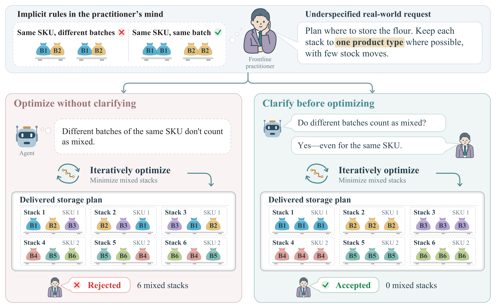
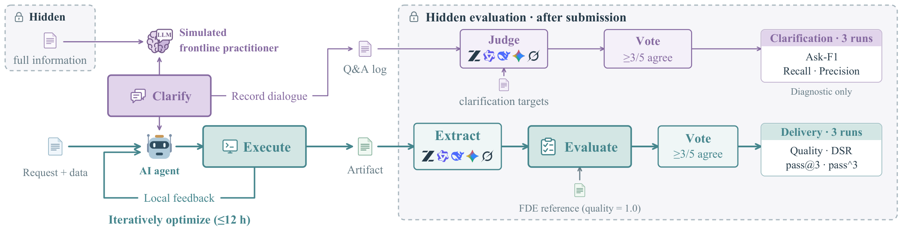
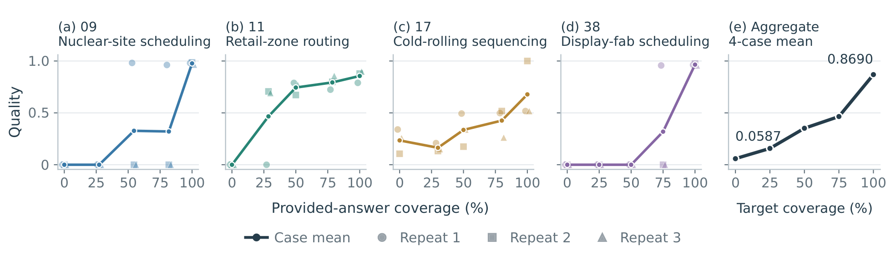

# FDE-Bench

从模糊业务需求到可交付方案的 agent 评测基准。

## 这是什么

现有 agent 评测集把题目写清楚了——目标函数、约束、数据口径、提交格式全给。
真实客户不这样：他给你一句话和一个乱七八糟的表格，剩下的靠你自己弄明白。

FDE-Bench 保留真实业务会话的原始形态，评两件事：

- **澄清**：面对说不清的需求，agent 会不会问、问的是不是关键那几件事
- **求解**：补齐信息后，交付物是否满足硬约束、质量如何



**为什么需要澄清？** 客户要求尽量让每垛只有“一种产品”，但同一 SKU 的不同批次也算混装。
agent 必须先问清这条规则，再优化存储分配和搬运方案。图中对话用于说明任务，不是实测运行记录。

## 如何评测交付



agent 与模拟客户澄清需求，在本地执行、检查并迭代方案后提交交付物。
隐藏评测器只在提交后运行，检查硬约束，并以客户接受的 FDE 方案为质量参考（归一化为 1.0）；
提问记录则单独评估需求覆盖率。求解过程中不提供隐藏评测分数或反馈。

## 四个主信息条件

同一批任务、同一个模型、同一个脚手架，只改「给 agent 多少信息」和是否回答提问：

| 条件 | agent 拿到 | 能否提问 |
|:--|:--|:--|
| **Hidden** | 客户原话 + 数据 | 无人应答 |
| **Interact** | 客户原话 + 数据 | 可提问，是否提问由 agent 自定 |
| **Interact-Req** | 客户原话 + 数据 | 强制提问到 agent 认为足够 |
| **Full** | 客户原话 + 完整背景信息 + 数据 | 无人应答 |

三条对照：

```
Hidden ─┬─ vs Full          →  卡在理解需求，还是算法能力？
        ├─ vs Interact     →  自主提问挣回多少？
        └─ vs Interact-Req →  强制澄清的增益是多少？

Interact 系列的提问记录 ── 比对考点 ──→ 问对了没？
```

`Interact-Conf`、`Full-Base`、`Full-Data`、`Full-Rule` 是消融条件，`oracle_k<N>`
是按 case 考点数动态展开的探索条件。旧内部名 `R/C/CF/F` 仍可兼容，但新文档和
正式实验统一使用上述名称。



**信息齐全之后，仍需正确实现。** 论文给 Codex + GPT-6-Astra 提供逐步扩大的已标注答案子集，
在四个案例上分别重复三次，观察信息覆盖率与交付质量的关系。收益因案例而异，并非始终单调；
100% 覆盖指获得全部已标注答案，**不等同于 `Full` 条件的完整业务信息文件**。

## 贡献新的 case

欢迎大家给我们提 PR，为后续版本贡献新的 case，也欢迎改进评测器或接入新的 agent。新的 case 请沿用现有 `case/<case-name>/` 结构，提供去敏后的题面和数据、完整需求、澄清考点、运行环境、输出 schema、确定性的 evaluator 和参考解。

请在 PR 中说明数据来源、去敏方式和分发权限，不要提交密钥或客户私有材料。可以从 [GitHub PR 页面](https://github.com/sponyo531/fde-bench/pulls) 开始。

## 目录

```
FDE-bench/
├── harness/              评测框架
│   ├── run_cli.py        统一入口（python -m harness）
│   ├── cli.py            单次 run 的编排
│   ├── matrix.py         批量矩阵 + 断点续跑
│   ├── conditions.py     信息条件 → prompt
│   ├── config.py         配置与角色（judge / answerer / extractor）
│   ├── backends/         脚手架适配层
│   │   ├── registry.py       自动发现（加 agent 无需登记）
│   │   ├── base.py           抽象契约
│   │   ├── _cli_spec.py      headless CLI 的共用机制
│   │   └── <agent>/          一个 agent 一个包，各带实测的坑
│   ├── clarify/          澄清：提问判定 / 模拟客户 / 澄清评分
│   ├── scoring/          评分：抽取 → 守恒校验 → evaluator → 用量报表
│   ├── isolation/        运行隔离：中立环境 / bwrap / docker
│   ├── tools/            独立工具（case 泄漏检查等）
│   └── tests/            单元测试
├── agents/               中立配置 + 各信息条件的指令块
├── case/                 已去敏并重新编号的任务
└── experiments.toml      可复现的实验矩阵
```

## 快速开始

```bash
cp config.toml.example config.toml     # 填端点与模型
export DELIVER_JUDGE_TOKEN=sk-...      # 澄清判定
export DELIVER_ANSWERER_TOKEN=sk-...   # 模拟客户
export FDE_OPENCODE_CONFIG=/path/to/private/opencode.jsonc
export DELIVER_AGENT_BASE_URL=https://your-chat-endpoint/v1
export DELIVER_AGENT_API_KEY=...
export DELIVER_RESPONSES_BASE_URL=https://your-responses-endpoint/v1
export DELIVER_RESPONSES_API_KEY=...
export DELIVER_DIRECT_BASE_URL=https://your-direct-endpoint/v1
export DELIVER_DIRECT_API_KEY=...

python -m harness --list                                  # 看可用脚手架/条件/实验
python -m harness -a opencode -m YOUR_PROVIDER/YOUR_MODEL -c Interact-Req  # 跑一个格子
python -m harness -a codex -c Hidden,Interact,Interact-Req,Full -k 3  # 四条件 × 3 次
python -m harness -e smoke                                # 跑预定义实验
python -m harness.scoring.report results/opencode                 # 出报表
```

`-a` 脚手架、`-m` 模型、`-c` 条件、`-k` 重复次数、`-d` 指定 case、`-e` 预定义实验。
断点续跑是默认行为：已完成且协议版本一致的 run 自动跳过。

`opencode-routes.example.jsonc` 列出矩阵和评分所需的中性路由及模型白名单。
把它复制到仓库外的私有路径，再按你的模型服务修改端点、模型映射和凭证变量。
`FDE_OPENCODE_CONFIG` 指向该文件；求解环境会读取它，抽取器默认读取同一份
隔离后的配置。也可另设 `FDE_EXTRACTOR_OPENCODE_CONFIG` 指向评分专用文件。
这些文件必须能在执行评分的环境中读取。容器运行时，求解配置先复制到每个
run 的隔离目录；评分专用文件若单独指定，需在评分环境中可见。

`chat/` 是 OpenAI 兼容 Chat Completions，`responses/` 是 Responses API，
`direct/` 是独立 Chat Completions 端点。公开 ID 不指定实际供应商或网关。
本发布版把实验矩阵的模型 ID 改为这些中性 ID，因此新结果目录名不同于旧运行；
比较旧结果时应按模型、条件、case 和重复编号对应，不能直接按目录名合并。
无私有端点和密钥时，`--list`、`--dry-run` 和离线评分可用，实际 LLM 运行不可用。

## 接入自己的 agent

**加一个文件夹即可，不用登记。** `ls harness/backends/` 就是当前支持的清单。

新建 `harness/backends/<你的agent>/__init__.py`，导出一个 `AGENTS` 字典：

```python
from .._cli_spec import _Spec, make_runner        # headless CLI 的常见形态

SPEC = _Spec(
    name="your-agent", bin="your-cli",
    first=("-p", "{message}", "--model", "{model}"),   # 首轮
    resume=("-p", "{message}", "--model", "{model}", "-c"),  # 续接
)
AGENTS = {"your-agent": make_runner(SPEC)}
```

`registry.py` 会自动发现它，`python -m harness -a your-agent -c Interact-Req` 立即可跑。

形态特殊的（如常驻 HTTP 服务）参照 `backends/opencode/serve.py` 自己实现
`AgentSession`，同样只需在 `__init__.py` 里导出 `AGENTS`。
某个包依赖坏掉不会影响其他 agent——`--list` 会显示它的加载失败原因。

澄清通道有两种形态，框架自动选择：有原生提问 tool 的走旁路拦截，
其余走文本多轮（agent 自然语言提问 → 框架下一轮回灌答案）。
各脚手架的适配代码位于 `harness/backends/`，可直接参照现有实现接入新的 CLI。

## 状态

发布包包含 49 个已去敏 case；运行结果默认写入仓库内的 `results/`。
